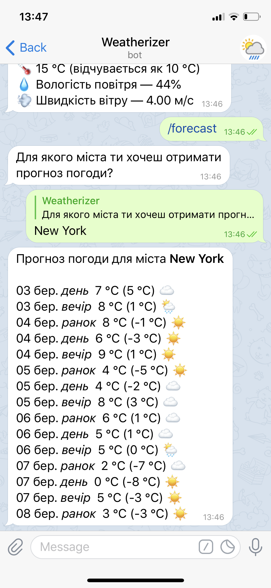

# Weatherizer
### About
This is a weather bot for Telegram, which alows you to find out current weather and get weather forecast for five days.

The bot is written in Java using [TelegramBots](https://github.com/rubenlagus/TelegramBots) library and OpenWeatherMap API.

Examples of work:

